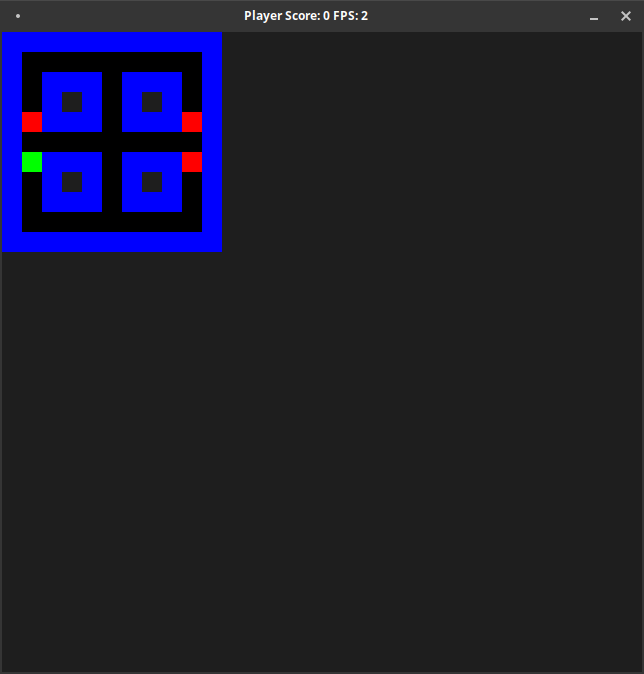

# CPPND: Capstone Game Example

This is the repo for the C++ Capstone project in the [Udacity C++ Nanodegree Program](https://www.udacity.com/course/c-plus-plus-nanodegree--nd213). 

The source code is basing on the CPPND Capstone Snake Game Example. It is modified to create the first simple implementation if a PacMan clone game.

Already implemented is:
* Loading of maps from .lvl files
* random haunting from ghosts
* movement of player

The player avatar can be controlled by the arrow keys

Next steps for implementation should be:
* collision detection (ghost vs. player)
* visualisation refinement (ghost coloring, different avatars for player and ghosts)
* more contorted maps
* etc

This phase of implementation is far away from pretty and exiting, but currently all rubric points should be covered.

## Dependencies for Running Locally
* cmake >= 3.7
  * All OSes: [click here for installation instructions](https://cmake.org/install/)
* make >= 4.1 (Linux, Mac), 3.81 (Windows)
  * Linux: make is installed by default on most Linux distros
  * Mac: [install Xcode command line tools to get make](https://developer.apple.com/xcode/features/)
  * Windows: [Click here for installation instructions](http://gnuwin32.sourceforge.net/packages/make.htm)
* SDL2 >= 2.0
  * All installation instructions can be found [here](https://wiki.libsdl.org/Installation)
  >Note that for Linux, an `apt` or `apt-get` installation is preferred to building from source. 
* gcc/g++ >= 5.4
  * Linux: gcc / g++ is installed by default on most Linux distros
  * Mac: same deal as make - [install Xcode command line tools](https://developer.apple.com/xcode/features/)
  * Windows: recommend using [MinGW](http://www.mingw.org/)

No additional libraries or packages are neccessary to build and run the project, compared to the capstone snake game example

## Basic Build Instructions

1. Clone this repo.
2. Make a build directory in the top level directory: `mkdir build && cd build`
3. Compile: `cmake .. && make`
4. Run it: `./SnakeGame`.

## Fullfilled rubric points:
* Readme 
  * see this file
* Compiling and Testing 
  * project compiles and runs without errors with make and cmake
* Loops, Functions, I/O
  * The project demonstrates an understanding of C++ functions and control structures -> everywhere
  * A variety of control structures are used in the project -> everywhere
  * The project is clearly organized into functions -> everywhere
  * The project accepts user input -> controller.cpp function HandleInput line 9
  * The project reads data from a file and process the data, or the program writes data to a file -> level.cpp function readLevelFile line 10
* Object oriented programming
  * The project uses Object Oriented Programming techniques -> everywhere
  * Classes use appropriate access specifiers for class members -> everywhere
  * Class constructors utilize member initialization lists -> mapLocation.h line 10
  * Classes abstract implementation details from their interfaces -> everywhere
  * Classes encapsulate behavior -> class gameObject, colour value handling
  * Classes follow an appropriate inheritance hierarchy -> parent class gameObject and child classes player / ghost
  * Overloaded functions -> class gameObject, function Update()
  * Derived class functions override virtual base class functions -> class player, function Update
  * Templates generalize functions in the project -> class MessageQueue in game.cpp, functions send and receive
* Memory Management
  * The project makes use of references in function declarations -> ghost.cpp function DetermineDirection line 117 and renderer.cpp function RenderGameObject line 63
  * The project uses destructors appropriately -> level.cpp line 14 and map.cpp line 22
  * The project uses scope / Resource Acquisition Is Initialization (RAII) where appropriate -> not used
  * The project follows the Rule of 5 -> -> no classes with move constructor are used in this project
  * The project uses move semantics to move data, instead of copying it, where possible -> no classes with move constructor are used in this project
  * The project uses smart pointers instead of raw pointers -> e.g. game.h lines 61 and 64
* Concurrency
  * The project uses multithreading -> ghost.cpp function BringToLife() line 39 and game.cpp lines 68 to 76
  * A promise and future is used in the project 
      - ghost.cpp function Haunt line 107 - 110
      - updateHandler.cpp function WaitingGhosts line 27
  * A mutex or lock is used in the project -> updateHandler.cpp functions permitLocationUpdate line 20 and function pushBack line 13
  * A condition variable is used in the project -> game.h class WaitingGhosts line 39

## CC Attribution-ShareAlike 4.0 International

Shield: [![CC BY-SA 4.0][cc-by-sa-shield]][cc-by-sa]

This work is licensed under a
[Creative Commons Attribution-ShareAlike 4.0 International License][cc-by-sa].

[![CC BY-SA 4.0][cc-by-sa-image]][cc-by-sa]

[cc-by-sa]: http://creativecommons.org/licenses/by-sa/4.0/
[cc-by-sa-image]: https://licensebuttons.net/l/by-sa/4.0/88x31.png
[cc-by-sa-shield]: https://img.shields.io/badge/License-CC%20BY--SA%204.0-lightgrey.svg
